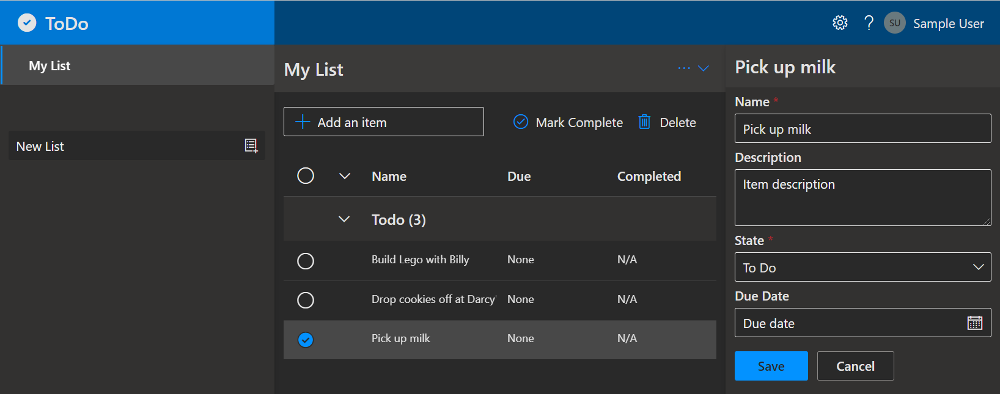
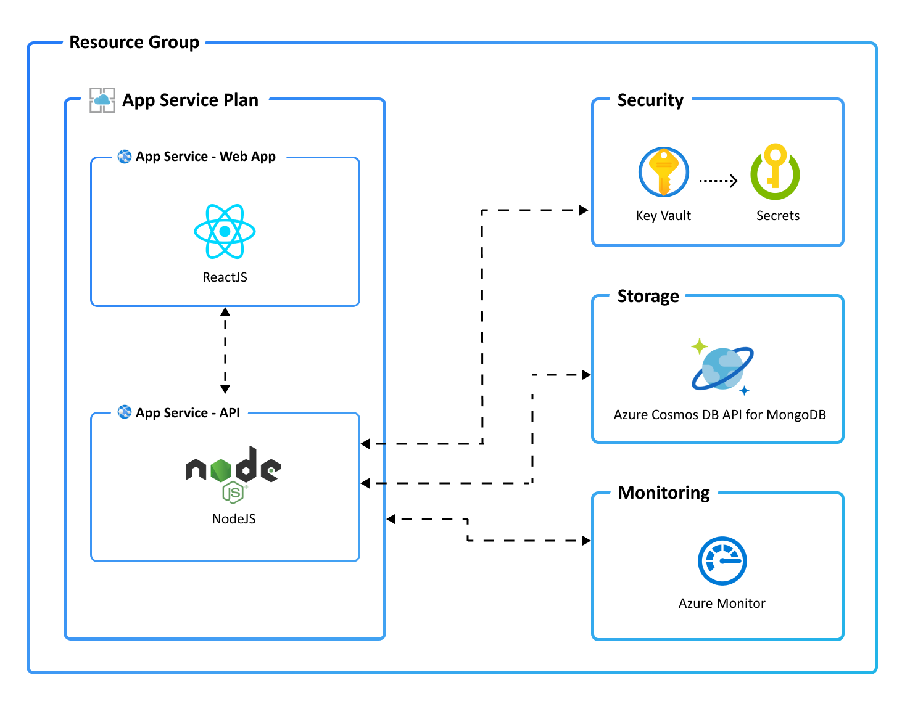

[](https://github.com/AndriyKalashnykov/todo-nodejs-mongo-terraform/actions/workflows/ci.yml)
[](https://hits.sh/github.com/AndriyKalashnykov/todo-nodejs-mongo-terraform/)
[](https://opensource.org/licenses/MIT)
[](https://app.renovatebot.com/dashboard#github/AndriyKalashnykov/todo-nodejs-mongo-terraform)
[](https://codespaces.new/AndriyKalashnykov/todo-nodejs-mongo-terraform)
[](https://vscode.dev/redirect?url=vscode://ms-vscode-remote.remote-containers/cloneInVolume?url=https://github.com/AndriyKalashnykov/todo-nodejs-mongo-terraform)

# Todo App - Node.js, React, MongoDB on Azure

A full-stack Todo application with a Node.js/Express 5 API, React 19/Vite frontend, and MongoDB (Azure Cosmos DB) database. Infrastructure is provisioned on Azure using Terraform and deployed via Azure Developer CLI (azd).



## Quick Start

```bash
azd auth login                # Log in to Azure (one-time)
azd init --template AndriyKalashnykov/todo-nodejs-mongo-terraform
azd up                        # Provision infrastructure and deploy
```

## Prerequisites

| Tool | Version | Purpose |
|------|---------|---------|
| [GNU Make](https://www.gnu.org/software/make/) | 3.81+ | Build orchestration |
| [Azure Developer CLI](https://aka.ms/azd-install) | latest | Provisioning and deployment orchestration |
| [Node.js](https://nodejs.org/) | 24+ | API backend and Web frontend runtime |
| [Terraform CLI](https://aka.ms/azure-dev/terraform-install) | latest | Infrastructure as Code |
| [Azure CLI](https://learn.microsoft.com/cli/azure/install-azure-cli) | latest | Azure authentication and account management |
| [Docker](https://www.docker.com/) | latest | Container builds |

Install Node.js and other tools:

```bash
make deps
```

## Available Make Targets

Run `make help` to see all available targets.

### Build & Run

| Target | Description |
|--------|-------------|
| `make build` | Build API and Web |
| `make lint` | Lint all code and Dockerfiles |
| `make test` | Run API unit tests |
| `make e2e` | Run Playwright end-to-end tests |
| `make run` | Start API and Web locally (API on :3100, Web on :3000) |
| `make clean` | Remove build artifacts |
| `make install` | Install npm dependencies for all packages |

### Docker

| Target | Description |
|--------|-------------|
| `make image-build` | Build Docker images for API and Web |
| `make image-run` | Run Docker containers |
| `make image-stop` | Stop Docker containers |

### CI

| Target | Description |
|--------|-------------|
| `make ci` | Full local CI pipeline (lint, test, build) |
| `make ci-run` | Run GitHub Actions workflow locally via [act](https://github.com/nektos/act) |

### Utilities

| Target | Description |
|--------|-------------|
| `make deps` | Install required tools (idempotent) |
| `make deps-check` | Show installed tool versions |
| `make renovate-validate` | Validate Renovate configuration |
| `make release` | Create and push a new tag |

## Application Architecture

This application uses the following Azure resources:

- [**Azure App Services**](https://docs.microsoft.com/azure/app-service/) to host the Web frontend and API backend
- [**Azure Cosmos DB API for MongoDB**](https://docs.microsoft.com/azure/cosmos-db/mongodb/mongodb-introduction) for storage
- [**Azure Monitor**](https://docs.microsoft.com/azure/azure-monitor/) for monitoring and logging
- [**Azure Key Vault**](https://docs.microsoft.com/azure/key-vault/) for securing secrets



> Refer to the [Pricing calculator for Microsoft Azure](https://azure.microsoft.com/pricing/calculator/) for cost estimates. Resource definitions are in `infra/main.tf`.

### Project Structure

```
src/api/       # Node.js/Express API (port 3100)
src/web/       # React/Vite frontend (port 3000)
infra/         # Terraform modules
tests/         # Playwright E2E tests
.github/       # GitHub Actions workflows
```

### Local Development

```bash
make deps      # Install tools
make build     # Build API and Web
make lint      # Lint everything
make test      # Run API tests
make run       # Start API on :3100, Web on :3000
```

## CI/CD

GitHub Actions runs on every push to `main`, tags `v*`, and pull requests.

| Job | Triggers | Steps |
|-----|----------|-------|
| **lint** | push, PR, tags | ESLint on API and Web |
| **build** | after lint passes | Build API and Web |
| **test** | after lint passes | Run API unit tests |
| **deploy** | tag push only | Provision and deploy to Azure via azd |

[Renovate](https://docs.renovatebot.com/) keeps dependencies up to date with platform automerge enabled.

## Next Steps

- [`azd pipeline config`](https://learn.microsoft.com/azure/developer/azure-developer-cli/configure-devops-pipeline?tabs=GitHub) - configure a CI/CD pipeline
- [`azd monitor`](https://learn.microsoft.com/azure/developer/azure-developer-cli/monitor-your-app) - monitor the application via Application Insights
- [Run and Debug Locally](https://learn.microsoft.com/azure/developer/azure-developer-cli/debug?pivots=ide-vs-code) - using VS Code and azd extension
- [`azd down --force --purge`](https://learn.microsoft.com/azure/developer/azure-developer-cli/reference#azd-down) - delete all Azure resources
- [Enable optional features, like APIM](./OPTIONAL_FEATURES.md) - for enhanced API protection and observability

## Security

### Roles

This template creates a [managed identity](https://docs.microsoft.com/azure/active-directory/managed-identities-azure-resources/overview) for your app inside your Azure Active Directory tenant, used to authenticate with Azure services like Key Vault via access policies.

### Key Vault

[Azure Key Vault](https://docs.microsoft.com/azure/key-vault/general/overview) securely stores the Cosmos DB connection string for the provisioned account.

## Resources

* [Original article](https://learn.microsoft.com/en-us/samples/azure-samples/todo-nodejs-mongo-terraform/todo-nodejs-mongo-terraform/)
* [Original repo](https://github.com/azure-samples/todo-nodejs-mongo-terraform/tree/main/)
* [Use Terraform as IaC for Azure Developer CLI](https://github.com/MicrosoftDocs/azure-dev-docs/blob/main/articles/azure-developer-cli/use-terraform-for-azd.md)
* [Store Terraform state in Azure Storage](https://github.com/MicrosoftDocs/azure-dev-docs/blob/main/articles/terraform/store-state-in-azure-storage.md)
* [Manage Azure Cosmos DB for NoSQL with Terraform](https://learn.microsoft.com/en-us/azure/cosmos-db/nosql/manage-with-terraform)
